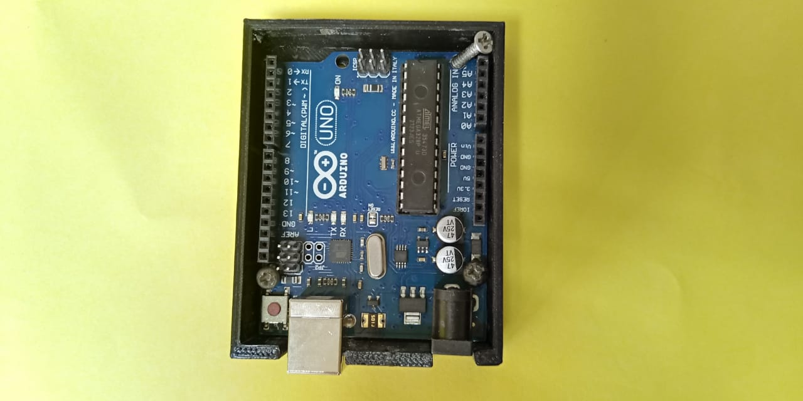
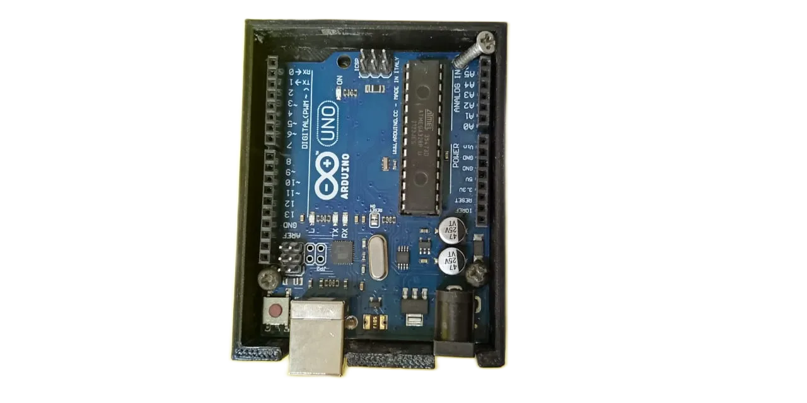

# Remover Fondo de Imagenes con IA

## Instrucciones

1. clona o descarga el proyecto (debes tener node.js instalado para poder usarlo)

2. Abre una terminal o consola

2. Ejecuta `npm install` para instalar las dependencias (este paso es necesario para que funcione la app)

3. Remover el fondo de imagenes:
    - Puedes usar la imagen test-input.jpg haciendo uso del comando `npm run test`

    - Puedes poner tus imagenes en la carpeta **/input** ejecutar `npm start` y obtendras tus imagenes sin fondo en **/output**

| Antes | Despues |
|---|---|
| |  |
